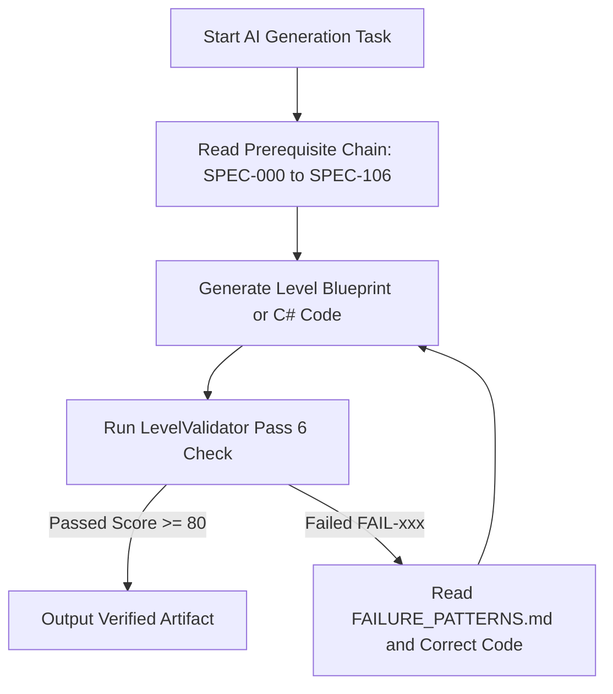

# AI_PIPELINE.md — AI Execution & Agent Generation Pipeline
## Spec ID: SPEC-402
## Version: 3.0 (AI-Executable)

---

### 1. PURPOSE
Defines the autonomous execution workflow, prompt chaining rules, specification dependencies, and verification loops for specialized AI agents constructing levels in *Echoes of You 2.0*.

### 2. SCOPE
Applies to all AI generation sessions, subagents, and automated code/level generation tasks in `Docs/` and `Assets/`.

### 3. AUTHORITY
Nivel 4 (Validación y QA). Subordinate to `SOURCE_OF_TRUTH.md` (`SPEC-000`) and `AI_RULEBOOK.md` (`SPEC-401`).

### 4. DEFINITIONS
- `Agent Prompt Loop`: Iterative execution cycle where an AI agent reads specs, generates code/data assets, and validates against `LevelValidator.cs`.
- `Prerequisite Reading Chain`: Mandatory sequence of specification documents read before code generation starts.

### 5. INPUTS
- [SOURCE_OF_TRUTH.md](file:///c:/Users/lol xdd/OneDrive/Documentos/Colegio/Echoes of you/Docs/Authority/SOURCE_OF_TRUTH.md) `[SPEC-000]`
- [INDEX.md](file:///c:/Users/lol xdd/OneDrive/Documentos/Colegio/Echoes of you/Docs/INDEX.md) `[SPEC-INDEX]`

### 6. OUTPUTS
- Executable levels and validated C# scripts.

### 7. RULES

- `[RULE-AIP-001]`: **Prerequisite Chain Rule**: An AI agent MUST inspect the following active canonical specs before instantiating scene content:
  1. `SOURCE_OF_TRUTH.md` `[SPEC-000]`
  2. `ANTI_PATTERNS.md` `[SPEC-002]`
  3. `ARCHITECTURE_GRAMMAR.md` `[SPEC-003]`
  4. `ROOM_LIBRARY.md` `[SPEC-004]`
  5. `SCALE_GUIDE.md` `[SPEC-106]`
- `[RULE-AIP-002]`: **Verification Loop**: After generating scene assets, the AI agent MUST execute `LevelValidator.cs` and ensure zero `FAIL-xxx` codes are raised.

### 8. ALGORITHMS

#### Algorithm 8.1: AI Agent Execution Loop

### 9. CONSTRAINTS
- `[CONS-AIP-001]`: Prohibido referencing superseded documents (`SCHOOL_ARCHITECTURE.md`, `MODULE_LIBRARY.md`, etc.).

### 10. VALIDATION
- `[VAL-AIP-001]`: `AI_RULEBOOK.md` asserts zero dead links in agent prompts.

### 11. EXAMPLES
- Agent execution prompt syntax.

### 12. FAILURE CASES
- `[FAIL-AIP-001]`: **Unvalidated Code Output**: Result: `FAIL-SYS-09`.

### 13. CROSS REFERENCES
- [INDEX.md](file:///c:/Users/lol xdd/OneDrive/Documentos/Colegio/Echoes of you/Docs/INDEX.md) `[SPEC-INDEX]`
- [LEVEL_VALIDATOR.md](file:///c:/Users/lol xdd/OneDrive/Documentos/Colegio/Echoes of you/Docs/Validation/LEVEL_VALIDATOR.md) `[SPEC-301]`

### 14. CHANGE HISTORY
- **v1.0 (2025-06-15)**: AI pipeline initial draft.
- **v3.0 (2026-07-25)**: Full refactor into 14-section AI-Executable canonical format updating dead spec links.