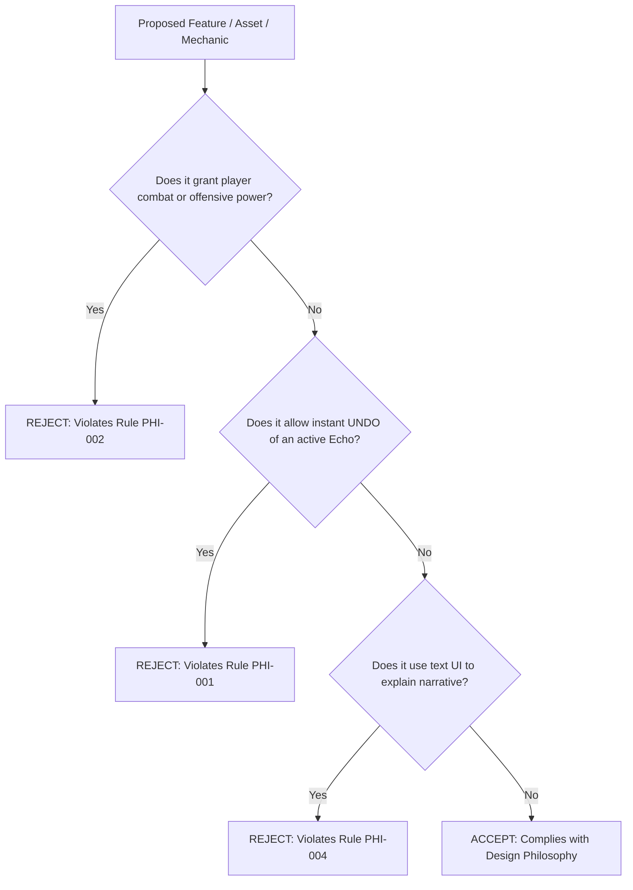

# DESIGN_PHILOSOPHY.md — Core Philosophical & Mechanical Directives
## Spec ID: SPEC-001
## Version: 3.0 (AI-Executable)

---

### 1. PURPOSE
Defines the inviolable emotional, mechanical, and narrative directives of *Echoes of You 2.0*. It governs the player powerlessness model, the physical irreversibility of the Echo trace, and the liminal aesthetic requirements across all systems.

### 2. SCOPE
Applies to 100% of game mechanics, character locomotion controllers, spatial layout design, UI presentation, and puzzle specifications. Excludes low-level engine initialization scripts.

### 3. AUTHORITY
Nivel 2 (Contexto Técnico y Filosofía). Subordinate only to `SOURCE_OF_TRUTH.md` (`SPEC-000`) and `ECHOES_BIBLE.md` (`SPEC-101`). Overrides all level blueprints and asset metadata.

### 4. DEFINITIONS
- `Echo Trace`: An irreversible, physical recording of past player movements ($12.0\text{s}$ max duration) that behaves as a solid collision body.
- `Player Powerlessness`: A design state where the player character possesses zero combat, double-jump, or fast-travel abilities.
- `Liminal Aesthetic`: High-contrast, flat-colored, low-poly architectural style inspired by early PS1/PS2 school environments.
- `Memory-Amber`: Color token `#FFBF00` reserved exclusively for narrative artifacts associated with Lyra.

### 5. INPUTS
- [SOURCE_OF_TRUTH.md](file:///c:/Users/lol xdd/OneDrive/Documentos/Colegio/Echoes of you/Docs/Authority/SOURCE_OF_TRUTH.md) `[SPEC-000]`
- [ECHOES_BIBLE.md](file:///c:/Users/lol xdd/OneDrive/Documentos/Colegio/Echoes of you/Docs/GameDesign/ECHOES_BIBLE.md) `[SPEC-101]`

### 6. OUTPUTS
- Compliance constraints for `PlayerController.cs`, `EchoRecorder.cs`, and `LevelValidator.cs`.
- Verification benchmarks for `LEVEL_SCORECARD.md` (`SPEC-302`).

### 7. RULES

- `[RULE-PHI-001]`: **Irreversibility Directive**: Prohibido implement any "Undo" or real-time rewind functionality for an active Echo recording. Once recorded, an Echo MUST complete its full playback cycle ($12.0\text{s}$) plus residual state ($2.5\text{s}$).
- `[RULE-PHI-002]`: **Locomotion Boundaries**: Player movement speed MUST be strictly bounded:
  - Base Walking Speed: $V_{walk} = 2.8\text{ m/s} \pm 0.0$
  - Maximum Sprint Speed: $V_{sprint} = 4.5\text{ m/s} \pm 0.0$
  - Jump Height: $H_{jump} = 1.2\text{ m} \pm 0.0$
  - Combat Abilities: $0$
- `[RULE-PHI-003]`: **Color Saturation Boundary**: All environmental materials MUST maintain HSL saturation within the range $S \in [0.10, 0.35]$. Vibrant or fluorescent colors on static architecture are forbidden.
- `[RULE-PHI-004]`: **No-Text Narrative Rule**: Zero spoken dialogues, on-screen subtitle boxes, or lore text logs may be rendered during gameplay across all 15 levels.

### 8. ALGORITHMS

#### Algorithm 8.1: Philosophical Acceptance Check


### 9. CONSTRAINTS
- `[CONS-PHI-001]`: Prohibido creating "boss fights", aggressive enemy NPCs, or reflex-based quick-time events.
- `[CONS-PHI-002]`: Prohibido introducing power-up pickups (e.g. speed boots, double-jump boots, telekinesis).

### 10. VALIDATION
- `[VAL-PHI-001]`: `LevelValidator.cs` parses `PlayerController.cs` and confirms `runSpeed == 4.5f` and `walkSpeed == 2.8f`.
- `[VAL-PHI-002]`: Automated inspector verifies zero `Text` or `Label` UI Toolkit elements exist with narrative tags in level UXMLs.

### 11. EXAMPLES

#### Example 11.1: Valid Echo Interaction Cycle
```yaml
recording_cycle:
  trigger_input: "KeyPress: R"
  record_duration_s: 12.0
  playback_latency_s: 0.8
  playback_duration_s: 12.0
  residual_solid_s: 2.5
  undo_allowed: false
  cancellation_method: "Only via EchoDisintegrationZone collision"
```

### 12. FAILURE CASES
- `[FAIL-PHI-001]`: **Mechanic Power Creep**: A script attaches double-jump logic to player locomotion. Result: `LevelValidator` flags `FAIL-PHI-01` and halts scene build.
- `[FAIL-PHI-002]`: **Text Exposure Violation**: A dialog box UI is triggered in gameplay. Result: `LevelValidator` flags `FAIL-PHI-02`.

### 13. CROSS REFERENCES
- [SOURCE_OF_TRUTH.md](file:///c:/Users/lol xdd/OneDrive/Documentos/Colegio/Echoes of you/Docs/Authority/SOURCE_OF_TRUTH.md) `[SPEC-000]`
- [ANTI_PATTERNS.md](file:///c:/Users/lol xdd/OneDrive/Documentos/Colegio/Echoes of you/Docs/Specs/ANTI_PATTERNS.md) `[SPEC-002]`
- [SCALE_GUIDE.md](file:///c:/Users/lol xdd/OneDrive/Documentos/Colegio/Echoes of you/Docs/Specs/SCALE_GUIDE.md) `[SPEC-106]`

### 14. CHANGE HISTORY
- **v1.0 (2025-02-14)**: Core vision statement.
- **v2.0 (2026-07-20)**: Quantified locomotion and saturation metrics.
- **v3.0 (2026-07-25)**: Full refactor into 14-section AI-Executable canonical format.
