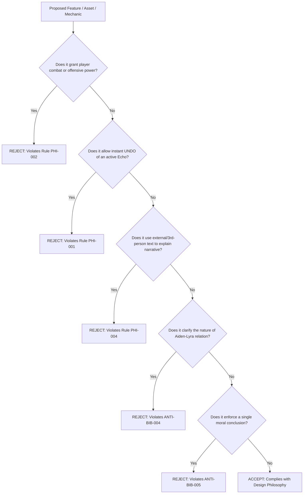
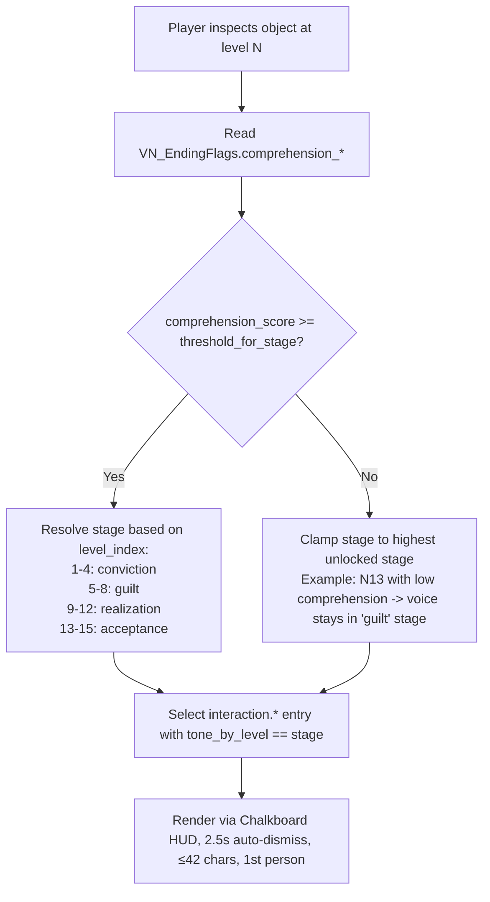

# DESIGN_PHILOSOPHY.md — Core Philosophical & Mechanical Directives
## Spec ID: SPEC-001
## Version: 3.0 (AI-Executable)

---

### 1. PURPOSE
Defines the inviolable emotional, mechanical, and narrative directives of *Echoes of You 2.0*. Governs the psychological arc of Aiden — a girl processing mistakes she made with someone she cared about (Lyra) — through the liminal architecture of her own mind. The game carries a **dual thesis**: (1) the past cannot be changed and must be carried without denial, and (2) acceptance is not resignation — one can still grow, let go, and stop repeating. Aiden begins the journey convinced she is right; whether the player helps her see the larger picture determines whether she reaches acceptance or remains trapped in denial, guilt, or self-sabotage. Governs the player powerlessness model, the physical irreversibility of the Echo trace, the evolution of Aiden's internal voice, and the liminal aesthetic requirements across all systems.

### 2. SCOPE
Applies to 100% of game mechanics, character locomotion controllers, spatial layout design, UI presentation, and puzzle specifications. Excludes low-level engine initialization scripts.

### 3. AUTHORITY
Nivel 2 (Contexto Técnico y Filosofía). Subordinate only to `SOURCE_OF_TRUTH.md` (`SPEC-000`) and `ECHOES_BIBLE.md` (`SPEC-101`). Overrides all level blueprints and asset metadata.

### 4. DEFINITIONS
- `Echo Trace`: An irreversible, physical recording of past player movements ($12.0\text{s}$ max duration) that behaves as a solid collision body. Metaphorically: a past action that cannot be undone but can be understood.
- `Player Powerlessness`: A design state where the player character possesses zero combat, double-jump, or fast-travel abilities. Aiden is not a warrior; she is a person revisiting her own mind.
- `Liminal Aesthetic`: High-contrast, flat-colored, low-poly architectural style inspired by early PS1/PS2 school environments. The school IS Aiden's cognitive architecture — every room is a memory, every corridor is a path between thoughts.
- `Memory-Amber`: Color token `#FFBF00` reserved exclusively for artifacts carrying Lyra's emotional imprint — objects that hurt to touch but teach when observed.
- `Echo-Cyan`: Color token `#4FC3E8` representing quiet acceptance, distance without hostility, and the possibility of letting go.
- `Wrongness-Red`: Color token `#B23A3A` for moments of rupture, self-sabotage, or the pain of confrontation.
- `Internal Voice`: Diegetic, contextual pop-up system (`interaction.*`) that renders Aiden's 1st-person introspection (≤42 chars) via the Chalkboard HUD. The tone evolves per level (see `RULE-PHI-005`), starting from conviction ("Yo tengo razón") and potentially reaching acceptance ("Puedo soltar eso").
- `Narrative Dual-Thesis`: The unsolvable tension between *accepting the past* (it cannot be changed) and *improving as a person* (acceptance enables growth). Neither half can override the other in-text; they coexist as the lived emotional experience of the player.

### 5. INPUTS
- [SOURCE_OF_TRUTH.md](file:///c:/Users/lol xdd/OneDrive/Documentos/Colegio/Echoes of you/Docs/Authority/SOURCE_OF_TRUTH.md) `[SPEC-000]`
- [ECHOES_BIBLE.md](file:///c:/Users/lol xdd/OneDrive/Documentos/Colegio/Echoes of you/Docs/GameDesign/ECHOES_BIBLE.md) `[SPEC-101]`

### 6. OUTPUTS
- Compliance constraints for `PlayerController.cs`, `EchoRecorder.cs`, and `LevelValidator.cs`.
- Verification benchmarks for `LEVEL_SCORECARD.md` (`SPEC-302`).

### 7. RULES

- `[RULE-PHI-001]`: **Irreversibility Directive**: Prohibido implement any "Undo" or real-time rewind functionality for an active Echo recording. Once recorded, an Echo MUST complete its full playback cycle ($12.0\text{s}$) plus residual state ($2.5\text{s}$).
- `[RULE-PHI-002]`: **Locomotion Boundaries**: Player movement speed MUST be strictly bounded (cross-ref `CONSTANTS_REGISTRY.yaml`):
  - Base Walking Speed: $V_{walk} = 2.8\text{ m/s} \pm 0.0$
  - Maximum Sprint Speed: $V_{sprint} = 4.2\text{ m/s} \pm 0.0$
  - Jump Height: $H_{jump} = 1.2\text{ m} \pm 0.0$
  - Combat Abilities: $0$
- `[RULE-PHI-003]`: **Color Saturation Boundary**: All environmental materials MUST maintain HSL saturation within the range $S \in [0.10, 0.35]$. Vibrant or fluorescent colors on static architecture are forbidden.
- `[RULE-PHI-004]`: **No-Text Narrative Rule**: Zero external dialogues, on-screen subtitle boxes, or external narration may be rendered during gameplay across all 15 levels. Exception: Aiden's first-person internal voice via `interaction.*` pop-ups (≤42 chars), rendered only through the Chalkboard HUD subsystem.
- `[RULE-PHI-005]`: **Variable Internal Voice by Stage**: The emotional tone of all `interaction.*` introspection pop-ups MUST map to Aiden's psychological progression across the 15-level arc:
  - N01–N04 (`denial` / `conviction`): Aiden is sure she is right. Tone: defensive, short, deflecting. Example: "Yo no fui la que se fue."
  - N05–N08 (`guilt` / `first crack`): Aiden begins to feel weight. Tone: heavier, fragmented, self-accusatory. Example: "Pude haber callado menos."
  - N09–N12 (`realization` / `partial insight`): Aiden sees parts of the picture. Tone: uncertain, tentative, searching. Example: "Esto también lo armé yo."
  - N13–N15 (`acceptance` / `letting go`): Aiden can hold the memory without gripping it. Tone: calm, present-tense, forward-leaning. Example: "Puedo soltar esto sin romperlo."
  - **Catch-22 Rule**: If the player has not accumulated the insight flags (`vn_flag comprehension_*`) required by a late level, Aiden's voice regresses to an earlier stage even in N13–N15. This is intentional: the voice reflects *what Aiden currently understands*, not the level index.

### 8. ALGORITHMS

#### Algorithm 8.1: Philosophical Acceptance Check


#### Algorithm 8.2: Aiden's Psychological Stage Resolver


The algorithm ensures Aiden's voice reflects *what she has understood*, not linear progression. A player who rushes without engaging the introspection system will hear defensive Aiden in every level — culminating in a "bad ending" (Aislamiento / Ruminación). A player who inspects, reads, and absorbs will gradually unlock the next stage, culminating in Aceptación.

### 9. CONSTRAINTS
- `[CONS-PHI-001]`: Prohibido creating "boss fights", aggressive enemy NPCs, or reflex-based quick-time events.
- `[CONS-PHI-002]`: Prohibido introducing power-up pickups (e.g. speed boots, double-jump boots, telekinesis).

### 10. VALIDATION
- `[VAL-PHI-001]`: `LevelValidator.cs` parses `PlayerController.cs` and confirms `runSpeed == 4.5f` and `walkSpeed == 2.8f`.
- `[VAL-PHI-002]`: Automated inspector verifies zero `Text` or `Label` UI Toolkit elements exist with narrative tags in level UXMLs.

### 11. EXAMPLES

#### Example 11.1: Valid Echo Interaction Cycle
```yaml
recording_cycle:
  trigger_input: "KeyPress: R"
  record_duration_s: 12.0
  playback_latency_s: 0.8
  playback_duration_s: 12.0
  residual_solid_s: 2.5
  undo_allowed: false
  cancellation_method: "Only via EchoDisintegrationZone collision"
```

### 12. FAILURE CASES
- `[FAIL-PHI-001]`: **Mechanic Power Creep**: A script attaches double-jump logic to player locomotion. Result: `LevelValidator` flags `FAIL-PHI-01` and halts scene build.
- `[FAIL-PHI-002]`: **Text Exposure Violation**: A dialog box UI is triggered in gameplay. Result: `LevelValidator` flags `FAIL-PHI-02`.
- `[FAIL-PHI-003]`: **Stage Regression Mismatch**: An `interaction.*` pop-up in N14 uses `conviction` tone while `comprehension_score` is high. Result: `TextInspector` flags `FAIL-PHI-03` — the voice must track comprehension, not just level index.
- `[FAIL-PHI-004]`: **Ambiguity Leak**: A pop-up uses a forbidden word ("amiga", "novia", "pareja", "relación"). Result: `TextInspector` flags `FAIL-PHI-04`.

### 13. CROSS REFERENCES
- [SOURCE_OF_TRUTH.md](file:///c:/Users/lol xdd/OneDrive/Documentos/Colegio/Echoes of you/Docs/Authority/SOURCE_OF_TRUTH.md) `[SPEC-000]`
- [ANTI_PATTERNS.md](file:///c:/Users/lol xdd/OneDrive/Documentos/Colegio/Echoes of you/Docs/Specs/ANTI_PATTERNS.md) `[SPEC-002]`
- [SCALE_GUIDE.md](file:///c:/Users/lol xdd/OneDrive/Documentos/Colegio/Echoes of you/Docs/Specs/SCALE_GUIDE.md) `[SPEC-106]`
- [NARRATIVA_INTERNA.md](file:///c:/Users/lol xdd/OneDrive/Documentos/Colegio/Echoes of you/Docs/GameDesign/NARRATIVA_INTERNA.md) `[DOC-102]`

### 14. CHANGE HISTORY
- **v1.0 (2025-02-14)**: Core vision statement.
- **v2.0 (2026-07-20)**: Quantified locomotion and saturation metrics.
- **v3.0 (2026-07-25)**: Full refactor into 14-section AI-Executable canonical format.
- **v3.1 (2026-08-02)**: Reescritura narrativa dual — Aiden como chica procesando errores con Lyra; tesis dual (aceptar el pasado + mejorar como persona); `Memory-Amber`/`Echo-Cyan`/`Wrongness-Red` redefinidas con peso emocional; `Internal Voice` y `Narrative Dual-Thesis` como definiciones formales; RULE-PHI-005 (voz interna variable por etapa con Catch-22); Algorithm 8.2 (Stage Resolver que acopla tono a comprehension_score); ANTI-BIB-004/005 referenciados; FAIL-PHI-003/004 nuevos.
