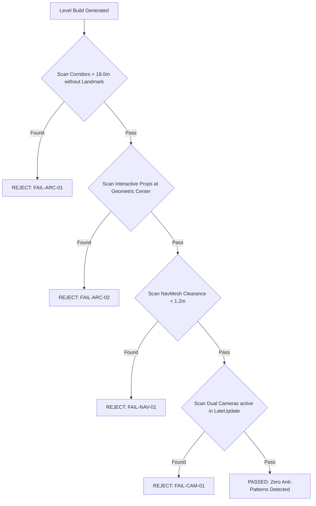

# ANTI_PATTERNS.md — Quantitative Blacklist of Prohibited Decisions
## Spec ID: SPEC-002
## Version: 3.0 (AI-Executable)

---

### 1. PURPOSE
Establishes an exhaustive, quantitative blacklist of forbidden design decisions for specialized AI agents across level generation, spatial geometry, camera programming, lighting, puzzle wiring, and prop placement.

### 2. SCOPE
Applies to all AI generation routines, `EchoesNewProductionBuilder.cs`, `LevelBlueprint` assets, and scene assembly pipelines. Excludes offline documentation formatting.

### 3. AUTHORITY
Nivel 3 (Especificación Ejecutable). Subordinate to `SOURCE_OF_TRUTH.md` (`SPEC-000`) and `DESIGN_PHILOSOPHY.md` (`SPEC-001`).

### 4. DEFINITIONS
- `Anti-Pattern`: A prohibited spatial, procedural, or programmatic condition that results in immediate level rejection.
- `Clearance Radius`: Minimum unimpeded 3D navigation corridor required around props and geometry ($R_{clearance} \ge 1.2\text{ m}$).
- `Geometric Center`: The centroid of a room volume calculated as $(\frac{W}{2}, \frac{H}{2}, \frac{D}{2})$.

### 5. INPUTS
- [SOURCE_OF_TRUTH.md](file:///c:/Users/lol xdd/OneDrive/Documentos/Colegio/Echoes of you/Docs/Authority/SOURCE_OF_TRUTH.md) `[SPEC-000]`
- [DESIGN_PHILOSOPHY.md](file:///c:/Users/lol xdd/OneDrive/Documentos/Colegio/Echoes of you/Docs/GameDesign/DESIGN_PHILOSOPHY.md) `[SPEC-001]`

### 6. OUTPUTS
- Rejection codes (`FAIL-xxx`) for `LevelValidator.cs` (`SPEC-301`).
- Filtering rules for `EchoesNewProductionBuilder.cs`.

### 7. RULES

- `[RULE-ANTI-001]`: **Corridor Sightline Constraint**: Prohibido generating straight corridors longer than $18.0\text{ m}$ without at least 1 visual Landmark visible from the entrance.
- `[RULE-ANTI-002]`: **Geometric Center Exclusion**: Prohibido placing interactive puzzle elements (buttons, pressure plates) at the exact geometric center of a room. Minimum wall clearance $D_{wall} \ge 1.5\text{ m}$.
- `[RULE-ANTI-003]`: **Navigation Clearance Limit**: Prohibido any corridor, doorway, or inter-prop gap with net width $W_{clearance} < 1.2\text{ m}$.
- `[RULE-ANTI-004]`: **Camera Controller Competence**: Prohibido having 2 or more camera controllers (`CinemachineBrain` and `ThirdPersonCamera.cs`) executing transformations in `LateUpdate` simultaneously.
- `[RULE-ANTI-005]`: **Camera Occlusion Limit**: Prohibido positioning fixed cameras where solid geometry blocks line-of-sight to the player for $> 0.3\text{ s}$.
- `[RULE-ANTI-006]`: **Puzzle Timing Floor**: Prohibido designing puzzles requiring action timing precision $< 0.4\text{ s}$ between Echo and Player actions.
- `[RULE-ANTI-007]`: **Unwired Interactive Limit**: Prohibido any pressure plate or button that triggers a door without an explicit visual cable (`PuzzleWire.cs`).
- `[RULE-ANTI-008]`: **URP Light Intensity Cap**: Prohibido spot or point lights with intensity $> 5.0\text{ Lux}$ or range $> 25.0\text{ m}$.
- `[RULE-ANTI-009]`: **Prop Collision Intersection**: Prohibido prop BoundingBoxes intersecting $> 0.02\text{ m}$ with other props or floating $> 0.001\text{ m}$ above floor.

### 8. ALGORITHMS

#### Algorithm 8.1: Anti-Pattern Validation Filter

### 9. CONSTRAINTS
- `[CONS-ANTI-001]`: Prohibido instantiating URP materials via `new Material()` in `Update()` loops.
- `[CONS-ANTI-002]`: Prohibido using `GameObject.Find()` or `FindObjectsOfType()` inside runtime puzzle scripts.

### 10. VALIDATION
- `[VAL-ANTI-001]`: `LevelValidator.cs` executes NavMesh clearance sweeps and asserts $W_{clearance} \ge 1.2\text{ m}$ across 100% of nodes.
- `[VAL-ANTI-002]`: Scene hierarchy check asserts exactly 1 enabled `CinemachineBrain` or 1 `ThirdPersonCamera`.

### 11. EXAMPLES

#### Example 11.1: Error Code Matrix

| Error Code | Violation Description | Threshold Metric | Corrective Action |
|---|---|---|---|
| `FAIL-ARC-01` | Corridor too long without landmark | $> 18.0\text{ m}$ | Insert wall break or landmark prop |
| `FAIL-ARC-02` | Interactive element in geometric center | $< 1.5\text{ m}$ to wall | Offset element toward wall boundary |
| `FAIL-NAV-01` | NavMesh corridor too narrow | $< 1.2\text{ m}$ clearance | Space out props to restore $1.2\text{ m}$ gap |
| `FAIL-CAM-01` | Dual camera controllers in LateUpdate | $> 1$ controller | Disable legacy camera component |

### 12. FAILURE CASES
- `[FAIL-ANTI-003]`: **Silent Failure Suppression**: An AI agent bypasses validation checks. Result: Build pipeline rejects artifact with `FAIL-SYS-09`.

### 13. CROSS REFERENCES
- [SOURCE_OF_TRUTH.md](file:///c:/Users/lol xdd/OneDrive/Documentos/Colegio/Echoes of you/Docs/Authority/SOURCE_OF_TRUTH.md) `[SPEC-000]`
- [ARCHITECTURE_GRAMMAR.md](file:///c:/Users/lol xdd/OneDrive/Documentos/Colegio/Echoes of you/Docs/Specs/ARCHITECTURE_GRAMMAR.md) `[SPEC-003]`
- [LEVEL_VALIDATOR.md](file:///c:/Users/lol xdd/OneDrive/Documentos/Colegio/Echoes of you/Docs/Validation/LEVEL_VALIDATOR.md) `[SPEC-301]`

### 14. CHANGE HISTORY
- **v1.0 (2026-07-20)**: Initial draft of prohibited rules.
- **v3.0 (2026-07-25)**: Full refactor into 14-section AI-Executable canonical format.
