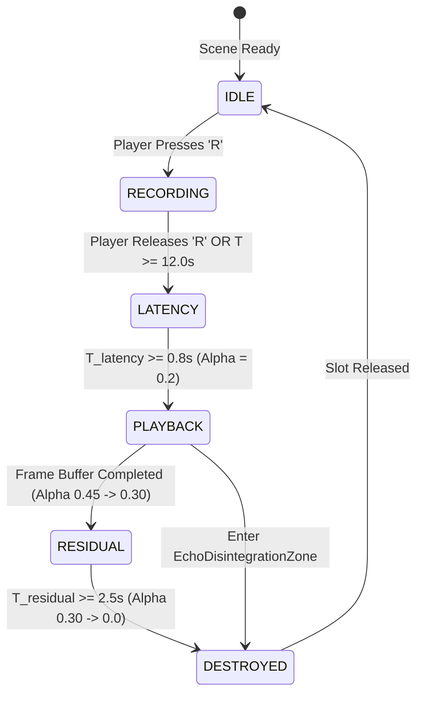

# ECHO_GRAMMAR.md — Echo Mechanic Technical Specification
## Spec ID: SPEC-107
## Version: 4.0 (AI-Executable)

---

### 1. PURPOSE
Specifies technical parameters, execution state machines, latencies, physical collider bounds, and collision rules for the Echo mechanic in *Echoes of You 2.0*. Regulates `EchoRecorder.cs`, `EchoPlayback.cs`, and `EchoKineticBody.cs`.

### 2. SCOPE
Applies to `EchoRecorder.cs`, `EchoPlayback.cs`, `EchoRecordingData.cs`, `EchoDisintegrationZone.cs`, and `EchoKineticZone.cs`. Excludes standard player locomotion without recording.

### 3. AUTHORITY
Nivel 3 (Especificación Ejecutable). Subordinate to `SOURCE_OF_TRUTH.md` (`SPEC-000`) and `ECHOES_BIBLE.md` (`SPEC-101`).

### 4. DEFINITIONS
- `Echo`: A deterministic, frame-by-frame physical re-enactment of recorded player inputs ($12.0\text{s}$ max duration) stored in `EchoRecordingData.cs`.
- `Playback Latency`: Fixed delay $T_{latency} = 0.8\text{s}$ between recording end and movement playback start.
- `Residual Duration`: Fixed duration $T_{residual} = 2.5\text{s}$ where the Echo remains a solid physical obstacle after completing playback.

### 5. INPUTS
- [ECHOES_BIBLE.md](file:///c:/Users/lol xdd/OneDrive/Documentos/Colegio/Echoes of you/Docs/GameDesign/ECHOES_BIBLE.md) `[SPEC-101]`
- [SCALE_GUIDE.md](file:///c:/Users/lol xdd/OneDrive/Documentos/Colegio/Echoes of you/Docs/Specs/SCALE_GUIDE.md) `[SPEC-106]`

### 6. OUTPUTS
- Recorded frame buffer in `EchoRecordingData.cs`.
- Physical Echo GameObject instantiated by `EchoPlayback.cs`.

### 7. RULES

- `[RULE-ECH-001]`: **Record Duration Boundaries**:
  - Standard Maximum Duration: $T_{max} = 12.0\text{ s} \pm 0.0$ (configurable to $20.0\text{s}$ max in narrative levels).
  - Minimum Valid Duration: $T_{min} = 1.0\text{ s}$.
  - Playback Start Latency: $T_{latency} = 0.8\text{ s} \pm 0.0$.
  - Residual Solid Duration: $T_{residual} = 2.5\text{ s} \pm 0.0$.
- `[RULE-ECH-002]`: **Echo Physical Collider**: Instantiated Echo MUST possess a `CapsuleCollider` ($H=1.80\text{m}, R=0.35\text{m}$) assigned to layer `Echo`. It MUST collide with Player, Environment, PressurePlates, and KineticBlocks.
- `[RULE-ECH-003]`: **Visual Material Token**: Echo mesh MUST use material `Mat_Token_echo-cyan` (`#4FC3E8`) with opacity alpha $\alpha \in [0.20, 0.80]$.
- `[RULE-ECH-004]`: **Irreversibility Enforcement**: An Echo in state `Playback` CANNOT be cancelled or deleted before completing its full cycle ($12.0\text{s} + 2.5\text{s}$), except via collision with `EchoDisintegrationZone`.
- `[RULE-ECH-005]`: **SoftReset Behavior** — The `Q` key (`SoftReset` action, `Player/SoftReset` binding) MUST execute the following actions in STRICT ORDER:
  1. Detiene y destruye todos los Ecos activos (SLOTS → IDLE).
  2. Teletransporta al Player al último Checkpoint (NO recarga la escena).
  3. Preserva el estado del puzzle (`PuzzleSignal`s permanecen en su estado actual).
  4. Preserva el progreso de nivel (no resetea el nivel completo).
  - **Not a violation** of the Irreversibilidad pillar: SoftReset is a player tool, not a narrative action. Echo actions are irreversible; the player's own meta-reset is not.

### 8. ALGORITHMS

#### Algorithm 8.0: Player Prefab Contract (HALT-1)

```yaml
player_prefab:
  addressable_key: "Assets/Prefabs/Player/Player.prefab"
  character_controller:
    radius: 0.35       # metros
    height: 1.80       # metros
    center: [0.0, 0.90, 0.0]
    step_offset: 0.30  # metros
    slope_limit: 45.0  # grados
    skin_width: 0.08   # metros
  initial_camera_euler: [0.0, 0.0, 0.0]
  spawn_facing_north: true
```

#### Algorithm 8.1: Echo Execution State Machine


#### Table 8.1: Echo Lifecycle States & Properties

| State Index | State Name | Duration (s) | Opacity Alpha ($\alpha$) | Rim Light Color | Collider Status | Enabled Interactions |
|---|---|---|---|---|---|---|
| **1** | `Recording` | $1.0\text{s} \text{ to } 12.0\text{s}$ | $0.00$ (Invisible) | Cyan `#4FC3E8` | Disabled | Input Frame Logging |
| **2** | `Latency` | $0.8\text{s}$ Fixed | $0.20$ | Cyan `#4FC3E8` | Frozen Point | Spawn Point Anchored |
| **3** | `Playback` | $1.0\text{s} \text{ to } 12.0\text{s}$ | $0.45 \rightarrow 0.30$ | Cyan `#4FC3E8` | Active Dynamic | Plates, Blocks, Collision |
| **4** | `Residual` | $2.5\text{s}$ Fixed | $0.30 \rightarrow 0.00$ | Alpha Fade | Static Fixed | Platform, Counterweight |

### 9. CONSTRAINTS
- `[CONS-ECH-001]`: Prohibido reactive AI algorithms that alter the recorded trajectory frame data during playback.
- `[CONS-ECH-002]`: Prohibido real-time "Undo" actions during the `Playback` state.

### 10. VALIDATION
- `[VAL-ECH-001]`: Automated test asserts `EchoRecorder.maxRecordSeconds == 12.0f` and `startLatencySeconds == 0.8f`.
- `[VAL-ECH-002]`: Physics integration test confirms Echo triggers `PressurePlate` and `PressurePlate_EchoOnly`.

### 11. EXAMPLES

#### Example 11.1: Echo Frame Data Buffer Structure in C# (HALT-2)
```csharp
[System.Serializable]
public struct EchoRecordFrame
{
    public float timestamp;                // segundos desde inicio de grabación (0.0 a 12.0)
    public Vector3 worldPosition;          // posición en espacio mundo (3 floats = 12 bytes)
    public Quaternion worldRotation;       // rotación en espacio mundo (4 floats = 16 bytes)
    public bool isJumping;                 // estado de salto
    public bool isInteracting;             // estado de interacción (E key)
    public float animatorSpeed;            // float para Animator.speed blend
    // v5.0 additions — required for accurate Echo ghost animator replay:
    public int animatorStateHash;          // Animator.GetCurrentAnimatorStateInfo(0).fullPathHash
    public float animatorNormalizedTime;   // Animator.GetCurrentAnimatorStateInfo(0).normalizedTime
    public CharacterStateFlags stateFlags; // packed bool flags for crouching, carrying, pushing
}

[System.Flags]
public enum CharacterStateFlags : byte
{
    None         = 0,
    IsCrouching  = 1 << 0,
    IsCarrying   = 1 << 1,
    IsPushing    = 1 << 2,
    IsGrounded   = 1 << 3,
}
// Frecuencia de sampleo: 30 Hz (1 frame cada 0.0333s)
// Buffer máximo: 12.0s × 30 Hz = 360 frames por slot
// Tamaño de buffer por slot: 360 × (12+16+1+1+4+4+4+1) bytes = 360 × 43 bytes ≈ 15.5 KB
// Máximo de slots simultáneos: 3 → Memoria máxima de Echo buffer ≈ 46.5 KB
```

#### Example 11.2: Echo Position Interpolation Algorithm (Cubic Hermite Spline)
```csharp
// Algoritmo de Interpolación de Eco (Cubic Hermite Spline)
public static Vector3 EvaluateEchoPosition(EchoFrame p0, EchoFrame p1, EchoFrame m0, EchoFrame m1, float t)
{
    float t2 = t * t;
    float t3 = t2 * t;
    return (2f*t3 - 3f*t2 + 1f)*p0.position + (t3 - 2f*t2 + t)*m0.position + (-2f*t3 + 3f*t2)*p1.position + (t3 - t2)*m1.position;
}
```

### 12. FAILURE CASES
- `[FAIL-ECH-001]`: **Record Duration Exceeded**: Recorder exceeds max threshold ($T > 12.0\text{s}$). Result: `EchoRecorder` automatically cuts recording and triggers `Latency` state.
- `[FAIL-ECH-002]`: **Collider Mismatch**: Echo collider height differs from player height ($H \ne 1.80\text{m}$). Result: `LevelValidator` flags `FAIL-ECH-02`.

### 13. CROSS REFERENCES
- [ECHOES_BIBLE.md](file:///c:/Users/lol xdd/OneDrive/Documentos/Colegio/Echoes of you/Docs/GameDesign/ECHOES_BIBLE.md) `[SPEC-101]`
- [PUZZLE_GRAMMAR.md](file:///c:/Users/lol xdd/OneDrive/Documentos/Colegio/Echoes of you/Docs/Specs/PUZZLE_GRAMMAR.md) `[SPEC-104]`

### 14. CHANGE HISTORY
- **v1.0 (2025-02-18)**: Core Echo mechanic draft.
- **v2.0 (2026-07-20)**: Quantified 12.0s duration and 0.8s latency.
- **v3.0 (2026-07-25)**: Full refactor into 14-section AI-Executable canonical format.
- **v4.0 (2026-07-25)**: HALT-1 resolved — player_prefab CharacterController contract added (Algorithm 8.0). HALT-2 resolved — EchoRecordFrame struct upgraded with animatorSpeed and buffer sizing math. RULE-ECH-005 added — SoftReset Q-key behavior defined.
