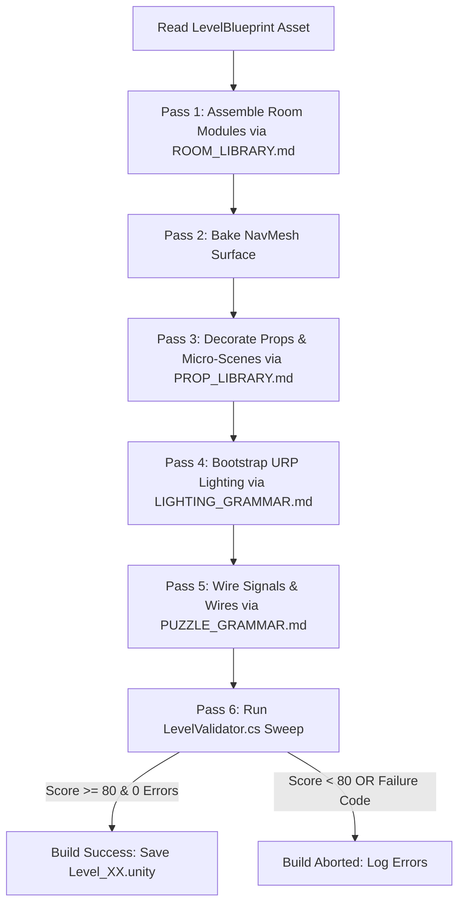

# LEVEL_PIPELINE.md — Automated Level Generation & Build Pipeline
## Spec ID: SPEC-201
## Version: 4.0 (AI-Executable)

---

### 1. PURPOSE
Defines the step-by-step algorithm and operational pipeline for AI agents and automated scripts (`EchoesNewProductionBuilder.cs`) to generate, populate, illuminate, wire, and validate levels in *Echoes of You 2.0*.

### 2. SCOPE
Applies to `EchoesNewProductionBuilder.cs`, `LevelBlueprint` assets, `EchoesPropDecorator.cs`, `LevelEnvironmentBootstrap.cs`, and `LevelValidator.cs`.

### 3. AUTHORITY
Nivel 3 (Especificación Ejecutable). Subordinate to `SOURCE_OF_TRUTH.md` (`SPEC-000`) and `BLUEPRINT_SPEC.md` (`SPEC-202`).

### 4. DEFINITIONS
- `Build Pass`: An individual step in the level generation sequence (Topology, Props, Lighting, Wiring, Validation).
- `Blueprint`: ScriptableObject asset `LevelBlueprint.cs` containing topological module placement data.

### 5. INPUTS
- [ARCHITECTURE_GRAMMAR.md](file:///c:/Users/lol xdd/OneDrive/Documentos/Colegio/Echoes of you/Docs/Specs/ARCHITECTURE_GRAMMAR.md) `[SPEC-003]`
- [ROOM_LIBRARY.md](file:///c:/Users/lol xdd/OneDrive/Documentos/Colegio/Echoes of you/Docs/Specs/ROOM_LIBRARY.md) `[SPEC-004]`
- [BUILDING_FLOW.md](file:///c:/Users/lol xdd/OneDrive/Documentos/Colegio/Echoes of you/Docs/GameDesign/BUILDING_FLOW.md) `[SPEC-103]`
- [ENVIRONMENT_STORYTELLING.md](file:///c:/Users/lol xdd/OneDrive/Documentos/Colegio/Echoes of you/Docs/Specs/ENVIRONMENT_STORYTELLING.md) `[SPEC-006]`

### 6. OUTPUTS
- Instantiated Unity gameplay scene `Level_XX_Name.unity`.
- Scorecard report generated by `LEVEL_SCORECARD.md` (`SPEC-302`).

### 7. RULES

- `[RULE-PIP-001]`: **Sequential Execution Order**: Level generation MUST execute Passes 1 through 6 sequentially:
  1. *Pass 1 — Topology Assembly* (`EchoesModuleFactory.cs` using `ROOM_LIBRARY.md`)
  2. *Pass 2 — Navigation Mesh Baking* (NavMesh Surface Bake)
  3. *Pass 3 — Prop & Micro-Scene Decoration* (`EchoesPropDecorator.cs` using `PROP_LIBRARY.md` and `ENVIRONMENT_STORYTELLING.md`)
  4. *Pass 4 — Lighting & Atmosphere Bootstrap* (`LevelEnvironmentBootstrap.cs` using `LIGHTING_GRAMMAR.md`)
  5. *Pass 5 — Puzzle Signal Wiring* (`PuzzleWire.cs` and `PuzzleCondition.cs` using `PUZZLE_GRAMMAR.md`)
  6. *Pass 6 — Automated Validation Check* (`LevelValidator.cs` using `LEVEL_VALIDATOR.md`)
- `[RULE-PIP-002]`: **Validation Gate**: If Pass 6 yields a score $< 80/100$ or detects any `FAIL-xxx` code, the scene build MUST be aborted.
- `[RULE-PIP-003]`: **Build Failure Recovery Protocol**: If any build pass fails during level assembly, the builder MUST execute `HandlePassFailure(passIndex, errorCode)` according to Algorithm 8.3 without leaving orphaned scene objects.

### 8. ALGORITHMS

#### Algorithm 8.1: Master Pipeline Execution Flow


#### Algorithm 8.2: NavMesh Baking Config for Pass 2 (HALT-8)

```yaml
navmesh_bake_config:
  agent_type: "Humanoid"
  agent_radius_m: 0.35
  agent_height_m: 1.80
  max_slope_deg: 45.0
  step_height_m: 0.30
  drop_height_m: 2.0
  jump_distance_m: 0.0    # sin salto NavMesh; Echo y Player saltan manualmente
  area_costs:
    Walkable: 1.0
    NotWalkable: 9999.0
    Jump: 2.0
    GhostPlatform: 2.0     # Layer 12 — traversable during Echo playback only
  area_bitmask_overrides:
    GhostPlatform:
      nav_area_id: 4        # Unity NavMesh Area index for GhostPlatform surfaces
      layer_index: 12
      cost_modifier: 2.0
      walkable_during_echo: true
      walkable_during_no_echo: false
  min_region_area: 2.0     # m²: elimina islas de NavMesh menores a 2m²
```

#### Algorithm 8.3: Pass Failure Recovery Handler (Task 4.1)

```csharp
// Protocolo de recuperación cuando Pass N falla
public static void HandlePassFailure(int failedPassIndex, string errorCode)
{
    switch (failedPassIndex)
    {
        case 1: // Topology failure
            // Acción: limpiar GameObjects parciales, lanzar FAIL-BLD-01
            EchoesNewProductionBuilder.CleanGeneratedObjects();
            BuildLogger.LogFatalError("FAIL-BLD-01", errorCode);
            break;
        case 3: // Missing prefab in Props
            // Acción: saltar prop específico, continuar con advertencia
            BuildLogger.LogWarning("WARN-PROP-01", $"Prop omitido: {errorCode}");
            break;
        case 6: // Validation failure
            // Acción: abort build, preservar escena para diagnóstico
            BuildLogger.LogFatalError("FAIL-VAL-01", errorCode);
            EditorUtility.DisplayDialog("Build Aborted", errorCode, "OK");
            break;
    }
}
```

### 9. CONSTRAINTS
- `[CONS-PIP-001]`: Prohibido executing Pass 5 (Wiring) before Pass 2 (NavMesh Baking).
- `[CONS-PIP-002]`: Prohibido manually editing generated scenes without updating `LevelBlueprint` asset.

### 10. VALIDATION
- `[VAL-PIP-001]`: `EchoesNewProductionBuilder.cs` logs step timestamps and asserts Pass 6 execution output.

### 11. EXAMPLES

#### Example 11.1: Automated Build Command in C#
```csharp
[MenuItem("Echoes/Build Level Scene")]
public static void BuildLevelFromBlueprint()
{
    LevelBlueprint bp = Selection.activeObject as LevelBlueprint;
    EchoesNewProductionBuilder.BuildPipeline(bp);
}
```

### 12. FAILURE CASES
- `[FAIL-PIP-001]`: **Pipeline Interruption**: Pass 3 fails due to missing prop prefab. Result: Pipeline aborts with `FAIL-SYS-01`.

### 13. CROSS REFERENCES
- [BLUEPRINT_SPEC.md](file:///c:/Users/lol xdd/OneDrive/Documentos/Colegio/Echoes of you/Docs/Specs/BLUEPRINT_SPEC.md) `[SPEC-202]`
- [LEVEL_VALIDATOR.md](file:///c:/Users/lol xdd/OneDrive/Documentos/Colegio/Echoes of you/Docs/Validation/LEVEL_VALIDATOR.md) `[SPEC-301]`

### 14. CHANGE HISTORY
- **v1.0 (2025-06-01)**: Pipeline draft.
- **v3.0 (2026-07-25)**: Full refactor into 14-section AI-Executable canonical format. Fixed 5 broken references to active specs.
- **v4.0 (2026-07-25)**: HALT-8 resolved — added NavMesh bake config (Algorithm 8.2). Task 4.1 resolved — added RULE-PIP-003 build failure recovery protocol (Algorithm 8.3).
- **v5.0 (2026-07-25)**: Stoppage 6 resolved — Added `GhostPlatform` area cost (2.0) and `area_bitmask_overrides` block mapping GhostPlatform to NavMesh Area ID 4, Layer 12. Added `walkable_during_echo`/`walkable_during_no_echo` flags.