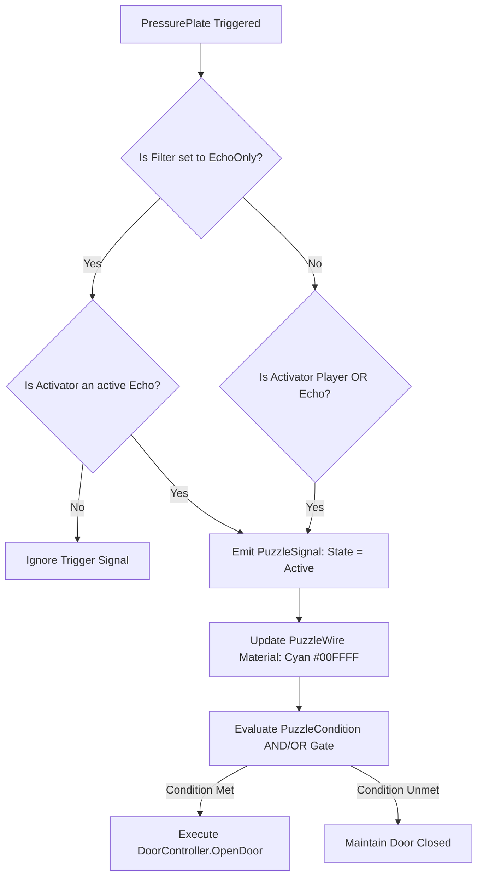

# PUZZLE_GRAMMAR.md — Puzzle Archetypes & Signal Wiring Specifications
## Spec ID: SPEC-104
## Version: 4.0 (AI-Executable)

---

### 1. PURPOSE
Specifies the pedagogical archetypes, signal component architecture (`PuzzleSignal.cs`), wiring rules (`PuzzleWire.cs`), and validation tests for puzzles in *Echoes of You 2.0*. Ensures every puzzle requires the temporal persistence, timing, or physical presence of an Echo.

### 2. SCOPE
Applies to `PressurePlate.cs`, `DoorController.cs`, `PuzzleWire.cs`, `PuzzleCondition.cs`, `GhostBridge.cs`, and `GoalTrigger.cs`. Excludes architectural geometry.

### 3. AUTHORITY
Nivel 3 (Especificación Ejecutable). Subordinate to `SOURCE_OF_TRUTH.md` (`SPEC-000`) and `ECHOES_BIBLE.md` (`SPEC-101`). Consolidates `PUZZLE_IMPLEMENTATION_MATRIX.md`.

### 4. DEFINITIONS
- `The Echo Button Test`: Mandatory validation check proving a puzzle CANNOT be solved using a generic static crate in place of an Echo.
- `PuzzleWire`: Visual indicator mesh showing real-time signal transmission (`Navy` `#000080` unpowered, `Cyan` `#00FFFF` powered).
- `Pedagogical Archetype`: Structuring category (`Teaching`, `Experimentation`, `Combination`, `Twist`, `Mastery`).

### 5. INPUTS
- [ECHOES_BIBLE.md](file:///c:/Users/lol xdd/OneDrive/Documentos/Colegio/Echoes of you/Docs/GameDesign/ECHOES_BIBLE.md) `[SPEC-101]`
- [ECHO_GRAMMAR.md](file:///c:/Users/lol xdd/OneDrive/Documentos/Colegio/Echoes of you/Docs/Specs/ECHO_GRAMMAR.md) `[SPEC-107]`

### 6. OUTPUTS
- Signal wiring logic for scene GameObjects.
- Puzzle validation assertions for `LevelValidator.cs`.

### 7. RULES

- `[RULE-PUZ-001]`: **The Echo Button Test Enforcement**: 100% of puzzles MUST require temporal recording ($12.0\text{s}$ max) or dual presence across $D > 4.0\text{m}$. Solvability with a static box is strictly prohibited. Validation MUST include both **static graph BFS** (via `AUTOMATED_PUZZLE_SOLVER_SPEC.md`) AND **headless runtime playtest** (via `AUTOMATED_PLAYTEST_HARNESS_SPEC.yaml` TEST-PLAY-002) to confirm physical distance prevents single-player bypass.
- `[RULE-PUZ-002]`: **Pedagogical Archetype Assignment**: Every puzzle MUST belong to 1 of the 5 archetypes in Table 8.1.
- `[RULE-PUZ-003]`: **Action Timing Precision Floor**: Minimum allowed synchronization window between Echo action and Player action is $T_{sync} \ge 0.4\text{s}$. Precision $< 0.4\text{s}$ is prohibited.
- `[RULE-PUZ-004]`: **Visual Wiring Requirement**: Every pressure plate or trigger connected to a door MUST include a visible `PuzzleWire.cs` component with material state toggling.
- `[RULE-PUZ-005]`: **Component Type Disambiguation**: Blueprint `type` field MUST use the exact C# class name from Table 8.0. The builder MUST NOT infer component class from string parsing or `customData`.
- `[RULE-PUZ-006]`: **Runtime Physics Validation**: All physics-based puzzle triggers must perform a `Physics.SyncTransforms()` call prior to `PuzzleCondition` evaluation to prevent sub-frame collider detection latency.

### 8. ALGORITHMS

#### Table 8.1: Pedagogical Archetypes & Progression Matrix

| Archetype | Purpose | Component Complexity | Timing Floor | Failure Penalty |
|---|---|---|---|---|
| `Teaching` | Isolated rule introduction | $1 \text{ PressurePlate} + 1 \text{ Door}$ | $1.5\text{ s}$ | Zero Risk |
| `Experimentation` | Rule variation in space | $2 \text{ PressurePlate} + 1 \text{ PuzzleWire}$ | $1.0\text{ s}$ | Time Delay |
| `Combination` | Unification of 2 learned rules | $2 \text{ PressurePlate} + 1 \text{ GhostBridge}$ | $0.6\text{ s}$ | Route Closure |
| `Twist` | Expectation subversion | $1 \text{ TemporalBridge} + 1 \text{ EchoOnly}$ | $0.4\text{ s}$ | Echo Dissolution |
| `Mastery` | Final chapter synthesis | `PuzzleCondition` (AND/OR gates) | $0.4\text{ s}$ | Scene SoftReset |

#### Algorithm 8.1: Signal Transmission Processing Loop


#### Algorithm 8.2: PuzzleWire Mesh Generation Spec (HALT-4)

```yaml
puzzle_wire_spec:
  generation_algorithm: "StraightLine_FloorProjected"
  # A linha é projetada sobre o NavMesh para evitar clipping de paredes.
  # Se o NavMesh path entre plate e door tem > 2 waypoints, o wire segue o path.
  # Ref: WIRE_PATHFINDING_SPEC.md [SPEC-125]
  mesh_radius_m: 0.04                    # radio del cilindro del wire
  vertex_floor_clearance_m: 0.05         # distancia mínima del suelo
  unpowered:
    shader: "Universal Render Pipeline/Lit"
    property: "_BaseColor"
    color_hex: "#000080"
    emission_enabled: false
  powered:
    shader: "Universal Render Pipeline/Lit"
    property: "_BaseColor"
    color_hex: "#00FFFF"
    emission_enabled: true
    # _EmissionColor = new Color(0.0f, 1.0f, 1.0f) * 1.5f (HDR multiplied)
    emission_color_hdr: {r: 0.0, g: 1.5, b: 1.5, a: 1.0}
    emission_property: "_EmissionColor"
    # En código C#:
    # mat.EnableKeyword("_EMISSION");
    # mat.SetColor("_EmissionColor", new Color(0f, 1.5f, 1.5f));

# Algoritmo de routing:
# Si NavMesh.CalculatePath(plate.position, door.position) tiene 1 segmento -> línea recta.
# Si tiene 2+ segmentos -> el wire sigue los waypoints del path proyectados a floor height + 0.05m.
```

#### Algorithm 8.3: GhostBridge Collision Toggling Spec (HALT-5)

```yaml
ghost_bridge_collision_spec:
  collision_method: "PhysicsLayerSwitch"
  # NO usar Collider.enabled — causa un frame de latencia
  # NO usar Shader Alpha Dissolve — no desactiva colisión física
  layer_when_echo_inactive: "GhostPlatform"   # Layer 12: sin colisión con Player
  layer_when_echo_active: "Default"            # Layer 0: colisión completa
  transition_duration_s: 0.0                   # instantáneo
  echo_detection_method: "TriggerOverlap"      # SphereOverlap radio 8.0m
```

#### Table 8.0: Puzzle Component Type Disambiguation Registry

| Blueprint `type` Value | C# Class to Instantiate | Activator Filter | `latch` Default | Description |
|---|---|---|---|---|
| `PressurePlate` | `PressurePlate.cs` | Player **OR** Echo | `false` | Standard plate activated by either body. |
| `PressurePlate_EchoOnly` | `PressurePlateEchoOnly.cs` | Echo **ONLY** | `false` | Rejects Player collider; requires active Echo ghost. |
| `PressurePlate_Latched` | `PressurePlate.cs` | Player **OR** Echo | `true` | Stays active permanently after first trigger. |
| `GhostBridge` | `GhostBridge.cs` | Echo Presence (Sphere $R=8.0\text{m}$) | N/A | Solid only while Echo ghost is within detection radius. |
| `TemporalBridge` | `TemporalBridge.cs` | Echo Timeline Active | N/A | Visible and solid only during Echo playback window. |
| `Door` | `DoorController.cs` | Signal from `PuzzleCondition` | N/A | Opens when upstream `PuzzleCondition` evaluates `true`. |
| `PuzzleCondition` | `PuzzleCondition.cs` | N/A | N/A | Boolean logic gate (`AND`/`OR`) combining signal inputs. |
| `LevelGoal` | `LevelGoal.cs` | Player Trigger Enter | N/A | Exit trigger; loads `next_scene_build_index`. |

> **Conflict Resolution:** If a blueprint specifies `type: "PressurePlate"` with `parameters.echo_only: true`, the builder MUST instantiate `PressurePlateEchoOnly.cs`, NOT `PressurePlate.cs`. The `type` field takes absolute precedence over any parameter inference.

### 9. CONSTRAINTS
- `[CONS-PUZ-001]`: Prohibido permanent softlocks where a player cannot trigger `SoftReset` or re-record.
- `[CONS-PUZ-002]`: Prohibido unwired interactive elements.

### 10. VALIDATION
- `[VAL-PUZ-001]`: `LevelValidator.cs` asserts all `PuzzleCondition.cs` components have non-null source signals and target receivers.
- `[VAL-PUZ-002]`: Runtime timing check confirms all active windows satisfy $T_{sync} \ge 0.4\text{f}$.

### 11. EXAMPLES

#### Example 11.1: Puzzle Logic Configuration in C#
```csharp
PuzzleCondition condition = gameObject.AddComponent<PuzzleCondition>();
condition.logicType = LogicType.AND;
condition.requiredSignals = new PuzzleSignal[] { signalPlate1, signalPlate2 };
condition.onConditionMet.AddListener(() => doorController.OpenDoor());
```

### 12. FAILURE CASES
- `[FAIL-PUZ-001]`: **Button Test Failure**: Puzzle solvable with static box. Result: `LevelValidator` flags `FAIL-PUZ-01`.
- `[FAIL-PUZ-002]`: **Unwired Circuit**: Pressure plate triggers door without `PuzzleWire`. Result: `FAIL-PUZ-02`.

### 13. CROSS REFERENCES
- [ECHOES_BIBLE.md](file:///c:/Users/lol xdd/OneDrive/Documentos/Colegio/Echoes of you/Docs/GameDesign/ECHOES_BIBLE.md) `[SPEC-101]`
- [ECHO_GRAMMAR.md](file:///c:/Users/lol xdd/OneDrive/Documentos/Colegio/Echoes of you/Docs/Specs/ECHO_GRAMMAR.md) `[SPEC-107]`

### 14. CHANGE HISTORY
- **v1.0 (2025-04-10)**: Core puzzle rules draft.
- **v2.0 (2026-07-20)**: Signal component catalog.
- **v3.0 (2026-07-25)**: Full refactor into 14-section AI-Executable canonical format.
- **v4.0 (2026-07-25)**: HALT-4 resolved — PuzzleWire StraightLine_FloorProjected mesh spec added (Algorithm 8.2). HALT-5 resolved — GhostBridge PhysicsLayerSwitch collision spec added (Algorithm 8.3). FIX-04: emission_intensity replaced with _EmissionColor HDR. FIX-05b: Layer 12 renamed to GhostPlatform (canonical layer name).
- **v5.0 (2026-07-25)**: Stoppage 4 resolved — Added Table 8.0 (Puzzle Component Type Disambiguation Registry) with 8 component entries and explicit conflict resolution rule. Added RULE-PUZ-005 (Component Type Disambiguation) and RULE-PUZ-006 (Runtime Physics Validation). Enhanced RULE-PUZ-001 with dual validation path (static BFS + headless playtest).
