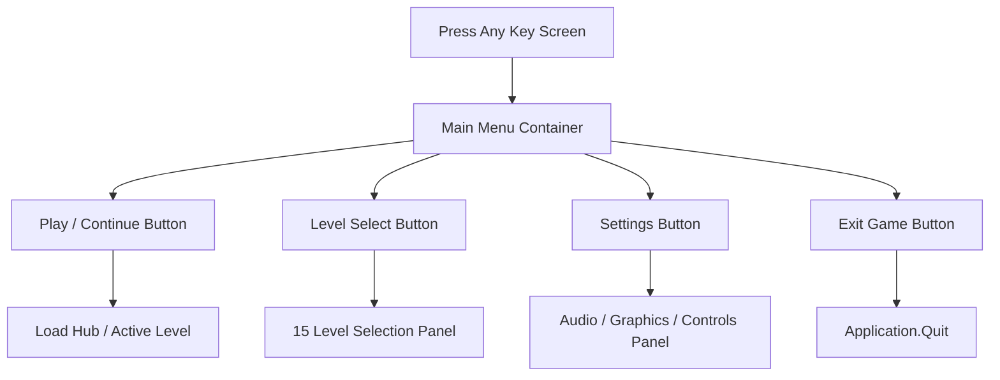

# UI_SPEC.md — UI Toolkit (UITK) Technical Specification
## Spec ID: SPEC-008
## Version: 3.0 (AI-Executable)

---

### 1. PURPOSE
Specifies the architecture, visual style, input navigation graphs, focus states, and liminal transition timing for UI Toolkit (UITK) interfaces in *Echoes of You 2.0* (Main Menu, Pause Menu, and Gameplay HUD).

### 2. SCOPE
Applies to `.uxml` templates and `.uss` stylesheets in `Assets/UI Toolkit/`, `MainMenuController.cs`, `PauseMenu.cs`, `GameHUD.cs`, `TutorialHUD.cs`, and `UIBootstrap.cs`. Excludes 3D world-space text elements.

### 3. AUTHORITY
Nivel 3 (Especificación Ejecutable). Subordinate to `SOURCE_OF_TRUTH.md` (`SPEC-000`) and `DESIGN_PHILOSOPHY.md` (`SPEC-001`). Consolidates `UI_ANALYSIS.md`.

### 4. DEFINITIONS
- `UITK`: Unity UI Toolkit framework (`UIDocument`, `VisualElement`, `Button`).
- `Focus State`: Navigation focus visual style (`:focus` selector in USS).
- `Liminal HUD Opacity`: Dynamic HUD opacity ($0.0$ default, $0.85$ during active Echo recording).

### 5. INPUTS
- [DESIGN_PHILOSOPHY.md](file:///c:/Users/lol xdd/OneDrive/Documentos/Colegio/Echoes of you/Docs/GameDesign/DESIGN_PHILOSOPHY.md) `[SPEC-001]`
- [PROJECT_CONTEXT.md](file:///c:/Users/lol xdd/OneDrive/Documentos/Colegio/Echoes of you/Docs/Technical/PROJECT_CONTEXT.md) `[SPEC-110]`

### 6. OUTPUTS
- UXML templates and USS stylesheets in `Assets/UI Toolkit/`.
- C# runtime controllers (`MainMenuController.cs`, `PauseMenu.cs`, `GameHUD.cs`).

### 7. RULES

- `[RULE-UI-001]`: **Exclusivity of UI Toolkit**: 100% of runtime user interfaces MUST be built using UI Toolkit (`UIDocument`). Canvas/UGUI legacy components are strictly prohibited.
- `[RULE-UI-002]`: **Focus State Transition Timing**: All interactive `Button` elements MUST define `:focus` and `:hover` selectors in USS with a transition duration $T_{trans} = 0.15\text{s}$.
- `[RULE-UI-003]`: **Dual Navigation Binding**: All menus MUST support dual navigation input:
  - Keyboard: `ArrowKeys` / `WASD`, `Enter` / `Space` (Submit), `Escape` (Cancel / Pause).
  - Gamepad: `D-Pad` / `LeftStick`, `SouthButton` (A), `EastButton` (B) / `StartButton`.
- `[RULE-UI-004]`: **Liminal HUD Opacity Behavior**: The Gameplay HUD MUST remain at base opacity $0.0$ (hidden) and fade to $0.85$ in $0.10\text{s}$ ONLY when `EchoRecorder.isRecording == true`.

### 8. ALGORITHMS

#### Table 8.1: UI Screen Matrix & Input Mappings

| Screen ID | UXML Document | USS Stylesheet | Default Opacity | Input Bindings | Focus Transition |
|---|---|---|---|---|---|
| **Main Menu** | `MainMenu.uxml` | `MainMenu.uss` | `1.00` | Arrows / D-Pad / Enter | Scale $1.02$, Fade $0.15\text{ s}$ |
| **Pause Menu** | `PauseMenu.uxml` | `PauseMenu.uss` | `0.90` (Overlay) | Escape / StartButton | Overlay Dither $0.20\text{ s}$ |
| **Gameplay HUD** | `GameHUD.uxml` | `GameHUD.uss` | `0.00` (Dynamic) | Recording Trigger | Opacity $0.0 \rightarrow 0.85$ ($0.10\text{ s}$) |
| **Tutorial HUD** | `TutorialHUD.uxml` | `TutorialHUD.uss` | `0.00` (Trigger) | Action Completion | Fade Out instant |

#### Algorithm 8.1: Main Menu Navigation Graph


### 9. CONSTRAINTS
- `[CONS-UI-001]`: Prohibido decorative fantasy/handwritten fonts. Typography MUST use clean sans-serif (`Inter` or `Roboto`).
- `[CONS-UI-002]`: Prohibido displaying persistent health bars, ammo counters, or minimaps in Gameplay HUD.

### 10. VALIDATION
- `[VAL-UI-001]`: `UIBootstrap.cs` verifies all UXML documents load without null element references in `Awake()`.
- `[VAL-UI-002]`: Automated USS parser asserts 100% of `.button` classes have `:focus` and `:hover` blocks.

### 11. EXAMPLES

#### Example 11.1: Standard USS Focus Block
```css
.menu-button {
    font-definition: resource("Fonts/Inter-Regular SDF");
    font-size: 24px;
    color: #CCCCCC;
    transition-duration: 0.15s;
}

.menu-button:hover, .menu-button:focus {
    color: #FFBF00;
    scale: 1.02 1.02;
}
```

### 12. FAILURE CASES
- `[FAIL-UI-001]`: **Missing Focus State**: A button lacks a `:focus` selector, breaking gamepad navigation. Result: `LevelValidator` flags `FAIL-UI-01`.
- `[FAIL-UI-002]`: **UGUI Legacy Detected**: Canvas component found in scene. Result: `FAIL-UI-02`.

### 13. CROSS REFERENCES
- [DESIGN_PHILOSOPHY.md](file:///c:/Users/lol xdd/OneDrive/Documentos/Colegio/Echoes of you/Docs/GameDesign/DESIGN_PHILOSOPHY.md) `[SPEC-001]`
- [PROJECT_CONTEXT.md](file:///c:/Users/lol xdd/OneDrive/Documentos/Colegio/Echoes of you/Docs/Technical/PROJECT_CONTEXT.md) `[SPEC-110]`

### 14. CHANGE HISTORY
- **v1.0 (2025-06-20)**: Initial UI Toolkit analysis.
- **v3.0 (2026-07-25)**: Full refactor into 14-section AI-Executable canonical format.
