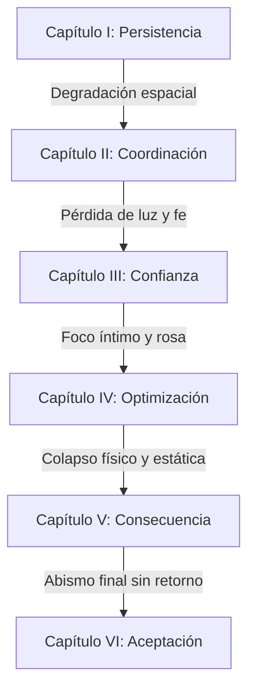

# VISUAL TARGET: ECHOES OF YOU 2.0
### Guía Oficial de Dirección y Target Visual de Producción
**Estudio de Desarrollo AAA — Dirección de Arte**
**Versión 2.0 (Julio 2026)**

---

## 1 — FILOSOFÍA ARTÍSTICA: LA NOSTALGIA DEGRADADA

El mundo de *Echoes of You* no es una escuela real, ni una simulación de laboratorio. Es la reconstrucción defectuosa, fragmentada y dolorosa de la memoria de Aiden sobre su adolescencia y su relación con Lyra. La dirección visual no debe buscar la fidelidad técnica (PBR, 4K), sino la **fidelidad emocional**.

La estética clave se define como **Nostalgia Degradada (Liminal PS1/PS2)**. Nos basamos en la imperfección de la memoria analógica y la melancolía del espacio escolar abandonado.

### Los Tres Pilares de la Filosofía Artística

1. **La Imperfección como Estilo (Dissonant Retro)**
   La memoria humana no recuerda detalles en 4K. Recuerda siluetas, texturas ásperas simplificadas y colores apagados bajo luces específicas. El uso del estilo visual PS1/PS2 temprano no es un truco nostálgico "retro-gaming" genérico; es el lenguaje técnico que representa la degradación del recuerdo. Todo asset que luzca demasiado nítido, pulido o moderno destruye este pilar.

2. **El Espacio Negativo Ocupado**
   Inspirado en *INSIDE* y *Silent Hill*, el vacío no es la ausencia de contenido, sino la presencia de la culpa. La escala arquitectónica debe hacer que Aiden se vea pequeño y vulnerable. Los pasillos largos y las aulas vacías sugieren que el espacio que antes albergaba vida ahora solo contiene aire viciado y ecos.

3. **El Eco como Fantasma Analógico, no como Tecnología**
   El eco de Aiden no es un clon de datos cibernéticos, ni un holograma de ciencia ficción con interfaz cian brillante. Es una proyección física de su pasado. Su representación visual debe evocar una cinta de video vieja (VHS), una doble exposición fotográfica o un proyector analógico que parpadea. Es imperfecto, rígido y trágico.

---

## 2 — MOODBOARDS Y ATMÓSFERA POR CAPÍTULO



### CAPÍTULO I — Persistencia (Niveles 1, 2, 3)
* **Mood:** Confusión cotidiana, aislamiento inicial. El espacio empieza siendo una escuela reconible, pero extrañamente vacía e interminable.
* **Paleta de Colores:** Dominancia de `corridor-navy` (65%) e `institutional-teal` (25%). Destellos tenues de `fluorescent-sick` (10%) en los techos.
* **Iluminación:** Luz fría, cenital y rítmica. Charcos de luz localizados con áreas de penumbra donde la geometría empieza a desvanecerse en la niebla.
* **Referencia Visual:** *Silent Hill 1* (el pasillo inicial), *Crow Country* (layouts opresivos).

### CAPÍTULO II — Coordinación (Niveles 4, 5, 8)
* **Mood:** Ritmo mecánico, la sensación de estar atrapado en un ciclo de repeticiones sin salida.
* **Paleta de Colores:** `corridor-navy` (60%), `faded-mustard` (30%) y el primer uso mecánico de `wrongness-red` (10%) en los pasillos de mantenimiento obstruidos.
* **Iluminación:** Sombras alargadas proyectadas por muebles apilados. El polvo en suspensión bajo los fluorescentes moribundos debe ser visible.
* **Referencia Visual:** *INSIDE* (zonas de pruebas y fábricas abandonadas).

### CAPÍTULO III — Confianza (Niveles 6, 7, 9)
* **Mood:** El vacío y el vértigo. El espacio pierde su coherencia estructural. Aparecen abismos donde debería haber suelo.
* **Paleta de Colores:** `corridor-navy` (70%), `sage-green` (20%) en la biblioteca y destellos de `echo-cyan` (10%) al manifestarse los puentes espectrales.
* **Iluminación:** La luz entra oblicua por ventanas altas, cruzando la niebla en haces definidos. El exterior del patio (Nivel 9) usa una luz grisácea de atardecer nublado que apaga las sombras.
* **Referencia Visual:** *Clock Tower* (interiores solemnes de madera y piedra), *Yume Nikki*.

### CAPÍTULO IV — Optimización (Niveles 10, 11)
* **Mood:** Nostalgia dolorosa, intimidad perdida. Los espacios pertenecen a Lyra.
* **Paleta de Colores:** Invasión sutil de `dusty-rose` (45%), `memory-amber` (15% en props narrativos) y `corridor-navy` (40%) en los bordes oscuros del encuadre.
* **Iluminación:** Luz cálida de atardecer bajo un cielo invisible. Las sombras ya no son duras, son difusas y cansadas.
* **Referencia Visual:** Fotografía analógica de doble exposición sobreexpuesta, *Persona 1* (habitaciones interiores melancólicas).

### CAPÍTULO V — Consecuencia (Niveles 12, 13)
* **Mood:** Culpa destructiva, confrontación con la verdad del pasado. El mundo se fragmenta de forma violenta.
* **Paleta de Colores:** Choque agresivo entre `wrongness-red` (30%), `corridor-navy` (50%) y un `echo-cyan` parpadeante y corrupto (20%).
* **Iluminación:** Luces rojas de emergencia de baja fidelidad y parpadeos rápidos. Gran contraste de luz y sombra.
* **Referencia Visual:** *Paratopic* (estática, cortes de cámara y texturas corruptas).

### CAPÍTULO VI — Aceptación (Niveles 14, 15)
* **Mood:** Silencio absoluto, desprendimiento, paz triste. El espacio ha desaparecido casi por completo.
* **Paleta de Colores:** `void-black` (80%), `corridor-navy` (15%), destellos mínimos de `memory-amber` y `echo-cyan` (5%).
* **Iluminación:** La única iluminación proviene del eco y de los propios objetos del escenario que flotan en el vacío. Aiden no proyecta sombra; la luz es irreal.
* **Referencia Visual:** *Journey* (el descenso final), *Yume Nikki* (el vacío infinito).

---

## 3 — PALETA DE COLORES OFICIAL (REGLAS DE CONTRASTE)

```
[void-black]         #0A0A0D (Fondo absoluto, abismo y márgenes)
[corridor-navy]      #1C2430 (Base de suelos, techos y sombras de niebla)
[fluorescent-sick]   #C9D4B0 (Luz fluorescente institucional, zumbido)
[memory-amber]       #E8B262 (Acento narrativo: objetos de Lyra)
[echo-cyan]          #4FC3E8 (El eco y sus manifestaciones físicas directas)
[wrongness-red]      #B23A3A (Peligro, trampa, error de sincronización)
[institutional-teal] #2B4A4A (Paredes de pasillos de aulas)
[faded-mustard]      #5A4A2E (Paredes de aulas y oficinas)
[sage-green]         #3A4A38 (Biblioteca y zonas de estudio)
[dusty-rose]         #4A3438 (Espacio de Lyra, recuerdos puros)
```

### Reglas de Distribución de Color en Escena
* **La Regla del 60-30-10:**
  * **60%**: Color de soporte oscuro (`corridor-navy` o `void-black`). Asegura que el juego mantenga su carácter nocturno y aislado.
  * **30%**: Color institucional del nivel (`institutional-teal`, `faded-mustard` o `sage-green`). Define la identidad de las aulas y pasillos.
  * **10% (o menos)**: Color de acento mecánico (`echo-cyan`, `wrongness-red` o `memory-amber`).
* **Uso exclusivo de `memory-amber`**: Este color solo puede aplicarse a objetos con peso narrativo directo o que guíen al jugador hacia la memoria de Lyra. Si se usa en puertas genéricas o plataformas comunes, el color pierde su significado.
* **Prohibición de gradientes digitales limpios**: Todos los colores en pantalla deben interactuar a través de la iluminación dura o el dither retro. No se permiten degradados de color calculados por postprocesado moderno de alta fidelidad.

---

## 4 — MATERIALES MAESTROS Y SHADERS

El Built-in Render Pipeline se utilizará con shaders personalizados para forzar la estética PS1/PS2. Queda prohibido el sombreado estándar moderno.

```
+-----------------------------------------------------------+
|                      retro-flat-lit                       |
|  - Albedo (Color plano / textura de ruido lo-fi)           |
|  - Metallic = 0.0, Smoothness = 0.05                       |
|  - Dithered Transparency (en objetos semi-transparentes)  |
|  - Vertex Snapping (opcional para simular precisión PS1)  |
+-----------------------------------------------------------+
```

### Shader Maestro 1: `RetroFlatLit`
* **Destino:** Geometría arquitectónica (paredes, suelos, columnas, pupitres).
* **Parámetros:**
  * `Smoothness` fijo a `0.05` para evitar reflejos especulares de aspecto plástico o metálico mojado.
  * `Metallic` en `0.0` absoluto.
  * Sin mapas de normales (Normal Maps), ni mapas de oclusión ambiental (AO Maps). El sombreado plano y los polígonos duros deben ser visibles.

### Shader Maestro 2: `AnalogGhost` (El Eco)
* **Destino:** El cuerpo físico del eco de Aiden y sus estelas.
* **Parámetros:**
  * `Dither Transparency`: No usar un canal alfa suave (`alpha 0.45`). El desvanecimiento transparente debe calcularse usando un patrón de dither (tramado de píxeles) de 2x2 o 4x4, imitando las limitaciones de transparencia por hardware de la era PS1.
  * `Frame Rate Limiter`: El shader debe interpolar las posiciones del vértice a un máximo de **15 FPS**, forzando que el eco se mueva de manera entrecortada (stop-motion) incluso si el juego corre a 60 FPS.
  * `Scanline Overlays`: Sutiles líneas horizontales oscuras que parpadean según el tracking de la grabación.

### Shader Maestro 3: `LiminalFog`
* **Destino:** El volumen de la niebla que rodea las escenas.
* **Parámetros:**
  * La niebla no debe calcularse como una neblina volumétrica 3D suave. Debe ser una niebla de rango lineal agresivo que corta la geometría de forma tajante, forzando la sensación de que el mundo termina a 15-20 metros del jugador.

---

## 5 — BIBLIOTECA DE TEXTURAS (LO-FI)

Queda prohibido el uso de mapas de texturas descargados de internet con propiedades PBR (Albedo, Normal, Roughness, Height). Las texturas en *Echoes of You 2.0* deben cumplir con los siguientes límites:

1. **Resolución Máxima:** `128x128` píxeles. En casos excepcionales (pizarras de aula con texto escrito o carteles grandes de la escuela), se permite `256x256`.
2. **Filtrado de Textura:** `Filter Mode: Point (no filter)` para conservar los bordes de los píxeles marcados. No usar filtrado Bilinear o Trilinear.
3. **Compresión:** Desactivada.

### Texturas Permitidas

* **`tex_school_wood_128`**: Grano de madera escolar de pino viejo y desgastado para pupitres, sillas y estanterías de la biblioteca. Un color marrón plano mezclado con ruido de píxeles.
* **`tex_cork_board_128`**: Textura de corcho para las carteleras de los pasillos. Textura de ruido denso con marcas de chinchetas.
* **`tex_chalkboard_256`**: Pizarra verde desgastada con restos de tiza blanca borrada a mano, usada en las aulas del Capítulo I, IV y V.
* **`tex_linoleum_floor_128`**: Baldosas de linóleo escolar de color gris sucio o Corridor Navy con juntas marcadas en píxeles.
* **`tex_plaster_wall_128`**: Textura de yeso rugoso pintado de las paredes de la escuela. Color sólido institucional con un patrón de ruido suave de suciedad.

---

## 6 — BIBLIOTECA DE DECALS (DETALLES SUTILES)

Los decals no se utilizan para decorar, sino para contar historias sobre el abandono del espacio y el desgaste de Aiden. Deben representarse como planos poligonales flotantes a 0.01 unidades de la pared (retro-style decals), evitando sistemas de proyección modernos.

* **Decal A: Humedad Analógica (`dec_moisture_lines`)**
  * **Uso:** En las esquinas de los techos y juntas de las paredes. Indica el paso del tiempo y el descuido del edificio escolar en la memoria de Aiden.
* **Decal B: Tiza de Lyra (`dec_lyra_notes`)**
  * **Uso:** Escribir palabras sueltas, esquemas o dibujos infantiles/adolescentes en las pizarras de las aulas de Lyra (Capítulo IV). Solo visibles bajo la luz del eco ambiental de Lyra.
* **Decal C: Marcas de Arrastre (`dec_floor_drag`)**
  * **Uso:** Marcas negras de rozadura de patas de sillas metálicas en el linóleo de las aulas. Guían de forma sutil la mirada del jugador hacia la posición correcta de los muebles en los puzzles.
* **Decal D: Grieta Arquitectónica (`dec_crack_liminal`)**
  * **Uso:** Líneas de fractura negras poligonales que aparecen en las paredes a partir del Capítulo III. Indican que el espacio mental se está fragmentando.

---

## 7 — BIBLIOTECA DE PROPS NARRATIVOS (EL DIARIO DEL AULA)

Cada prop en la escuela debe responder a la estética de escuela de educación pública de finales de los años 90 o principios de los 2000. Queda prohibido todo mobiliario moderno o futurista.

```
       Pupitre Escolar Retro (Prop Core)
     +-----------------------------------+
     |  [Madera contrachapada raspada]    |
     |  Patas metálicas verdes (Tubos)   |
     |  Sin tornillos visibles (Low-poly)|
     +-----------------------------------+
```

### Props Principales

* **Pupitre Doble de Aula**: Estructura de tubos de metal verde institucional con tapa de madera rayada. Los pupitres deben poder apilarse de forma desordenada en las esquinas de las aulas del Capítulo II.
* **Silla Escolar Modular**: Silla de plástico duro azul o verde oscuro montada sobre patas de metal doblado. Deben estar desparramadas por los suelos para sugerir una salida precipitada o un aula olvidada.
* **Estantería de Biblioteca Pesada**: Estantes de madera oscura llenos de libros planos sin detalles de lomo legibles. Crean los pasillos opresivos del Capítulo III.
* **Cartelera Escolar**: Marco de madera con fondo de corcho donde cuelgan hojas en blanco o avisos escolares deteriorados y rotos.
* **Radiador de Fundición**: Radiador de calefacción antiguo montado en la pared, con marcas de óxido en las tuberías.
* **Perchero de Pasillo**: Barra metálica con ganchos individuales para abrigos montada en la pared exterior de las aulas. Siempre vacía, excepto por un único abrigo olvidado en el Capítulo IV (objeto de acento en `memory-amber`).

---

## 8 — ILUMINACIÓN: REGLAS DE LA LUZ DE BAJO PRESUPUESTO

La iluminación en *Echoes of You 2.0* debe evocar la soledad física y la incomodidad de los espacios liminales. No usamos iluminación global (GI) ni reflejos de entorno realistas.

```
              Charco de Luz Fluorescente (Esquema)
            +---------------------------------------+
            |               Fluorescente            |
            |                    ||                 |
            |                \   ||   /             |
            |                 \  ||  /              |
            |    Zona de       v v v v              |
            |    Penumbra    +---------+            |
            |  ............. | Luz Hard| .......... |
            |  .             +---------+          . |
            |  .                                  . |
            +---------------------------------------+
```

### Reglas de Iluminación

1. **Una Sola Fuente Dominante por Espacio:**
   Cada aula o sección de pasillo debe estar iluminada por una sola fuente de luz principal (un tubo fluorescente en el techo, un foco de emergencia en una esquina, o la luz de una ventana). El resto del espacio debe caer rápidamente en la penumbra.
2. **Cookies de Luz Obligatorias:**
   Las luces direccionales que simulan la luz solar o de atardecer exterior deben usar cookies que proyecten el patrón de rejilla de las ventanas escolares y persianas americanas rotas en el suelo y las paredes, creando líneas de sombra duras que fragmenten el espacio.
3. **Niebla como Elemento Físico:**
   La niebla no es solo decorativa; define la distancia de lectura del jugador. Debe configurarse entre `0.015` y `0.035` de densidad, con un color idéntico al color de fondo (`corridor-navy` o `void-black`), para que la geometría parezca surgir de la oscuridad conforme Aiden se mueve.
4. **Zumbido Visual (Flickering):**
   Las luces fluorescentes de los techos deben parpadear con un script sutil que varíe su intensidad entre `0.2` y `1.2` de forma errática. Este parpadeo debe sincronizarse con un sutil efecto de audio de zumbido eléctrico.

---

## 9 — REGLAS DE COMPOSICIÓN

La cámara no es un observador pasivo. En *Echoes of You 2.0*, la cámara es la mirada ausente de Lyra o el peso de la culpa de Aiden.

1. **La Regla de Tercios Invertida:**
   Colocar a Aiden descentrado, usualmente en el tercio inferior derecho o izquierdo de la pantalla, dejando la mayor parte del encuadre ocupada por el pasillo vacío o la oscuridad de la niebla. Esto sugiere que el espacio vacío está "ocupado" por el eco del pasado.
2. **Compresión en Pasillos:**
   En los pasillos, usar un FOV estrecho (`50` o inferior) para comprimir la perspectiva. Esto hace que las paredes se sientan más cercanas a Aiden y acentúa la claustrofobia de los espacios liminales.
3. **Apertura en el Patio:**
   El patio (Nivel 9) es el único momento de respiro. El FOV se abre a `72`. La cámara se aleja de Aiden, mostrando la inmensidad del cielo gris sobre las paredes altas de la escuela, reforzando su aislamiento físico.
4. **Simetría Frontal en el Colapso:**
   En el Nivel 14 (Aceptación), la cámara se bloquea en un plano frontal absoluto de simetría horizontal. Aiden se mueve en un lado del espejo del vacío, su eco en el otro. La simetría perfecta transmite la aceptación de la pérdida y el equilibrio final.

---

## 10 — REGLAS PARA UI, MENÚS Y HUD (ELIMINACIÓN DE LA CIENCIA FICCIÓN)

El error más grave de la versión actual del proyecto es la interfaz tecnológica y clínica. La UI actual parece pertenecer a un juego de naves espaciales o a un laboratorio militar de inteligencia artificial, destruyendo la melancolía de la narrativa.

```diff
- [SYSTEM] Sync protocol loaded successfully. (TERMINOLOGÍA SCI-FI A ELIMINAR)
- RESONANCE_RADAR (ELEMENTO A ELIMINAR)
- COGNITIVE_SYNC_ACTIVE (ELEMENTO A ELIMINAR)
- TELEMETRIA_DE_SESION (ELEMENTO A ELIMINAR)
+ Registro de Ausencia: Sesión 01 (REDISEÑO EMOCIONAL)
+ Memoria grabada: 8s / 20s (INTERFAZ MÍNIMA)
+ Sonido de cinta de cassette en grabación (RETRO ANALÓGICO)
```

### Rediseño de Concepto de UI
* **Eliminar terminología cibernética:** Reemplazar palabras como "Neural Archives", "Diagnostics", "Cognitive Sync", "Calibration" por términos literarios o de memoria analógica ("Registro de Ausencia", "Recuerdos Grabados", "Diario de Sincronización").
* **Eliminar el Radar de Resonancia y Osciloscopios:** El menú principal no debe contener radares circulares de estilo militar o sci-fi. Debe mostrar una interfaz minimalista inspirada en carpetas escolares de cartón, hojas de examen de papel pautado o pantallas de monitores CRT viejos con tipografía monoespaciada sin adornos tecnológicos.
* **Eliminar las barras de estabilidad ("Stability") y recuperación ("Recall") del HUD:** El HUD en juego debe ser virtualmente invisible. Si el eco se degrada, el jugador debe saberlo al ver al eco parpadear analógicamente, perder frames de animación o desintegrarse visualmente, no leyendo una barra de vida de interfaz cian.

---

## 11 — REGLAS PARA VFX (EFECTOS VISUALES)

Los efectos de partículas en *Echoes of You 2.0* no deben usar texturas de chispas, destellos brillantes ni distorsiones espaciales digitales. Los VFX deben sentirse sucios, analógicos e imperfectos.

* **Partículas de Polvo en Suspensión (Dust Motes):**
  * **Uso:** Presentes en todas las aulas y pasillos iluminados por charcos de luz. Deben ser píxeles planos blancos de tamaño variable (`1x1` o `2x2` píxeles reales) que flotan lentamente en el aire.
* **La Grabación del Eco:**
  * **VFX:** Aiden no se rodea de un halo cian brillante de neón. Al grabar, los bordes de la pantalla sufren una ligera aberración cromática y distorsión de barrido horizontal (VHS Tracking Error), y el avatar de Aiden adquiere un efecto de doble exposición translúcido muy sutil.
* **La Degradación del Eco:**
  * **VFX:** Cuando el eco pierde fidelidad, su silueta sufre distorsiones de ruido analógico de barrido (scanlines con ruido blanco). Al terminar su tiempo residual de 2.5s, el eco no explota en partículas de luz; se desvanece instantáneamente con un parpadeo de dither de 1 frame, como una pantalla de televisión vieja que se apaga.

---

## 12 — REGLAS PARA SONIDO Y DISEÑO SONORO

El sonido en *Echoes of You 2.0* representa la soledad física y la memoria distorsionada. El 50% de la opresión proviene de lo que el jugador escucha.

* **El Sonido del Vacío (School Room Ambient):**
  * Cada nivel debe tener un sonido ambiente dominado por el silencio de baja frecuencia (low-frequency drone) y el zumbido eléctrico distante de las luces fluorescentes de los pasillos. El viento debe silbar de forma sutil a través de las rendijas de las ventanas en los niveles de biblioteca y escaleras.
* **La Distorsión Analógica del Pasado (Echo Footsteps):**
  * Las pisadas de Aiden en el presente suenan normales sobre la madera o el linóleo. Sin embargo, las pisadas y los sonidos de interacción del eco en reproducción deben sonar **distorsionados**.
  * Se debe aplicar un filtro de paso de banda (Bandpass Filter) estrecho que elimine los agudos y graves extremos de los pasos del eco, añadiendo un sutil zumbido de fondo (tape hiss / hum analógico), sugiriendo que Aiden está escuchando los pasos del eco a través de una grabación magnética vieja en su propia mente.
* **Los Fragmentos de Voz de Lyra:**
  * Las voces nunca deben escucharse limpias. Deben sonar con el eco natural de un aula vacía y filtradas como si procedieran de un interfono escolar viejo o de un casete grabado hace años en un radiocasete doméstico.

---

## 13 — REGLAS PARA CÁMARAS Y ENCUADRE

* **Cinemachine vs ThirdPersonCamera:**
  * Para asegurar que no ocurra jitter (vibración) de cámara, queda prohibido el uso simultáneo de Cinemachine y scripts manuales de `ThirdPersonCamera` en el mismo nivel. Se usará Cinemachine en los niveles de exploración compleja y pasillos de timing (Niveles 4, 5, 6, 8, 10), configurado con un script único que controle el foco. Los pasillos rectos cortos usarán la cámara manual fija de carril para forzar la perspectiva comprimida.
* **Transiciones de Cámara en el Salto de Fe (Nivel 6):**
  * Al iniciar la grabación antes de saltar al abismo del puente espectral, la cámara debe alejarse de Aiden de forma sutil hacia una posición elevada (cámara de vigilancia institucional alta), permitiendo que el jugador lea la posición del puente espectral con total claridad sin distorsión por la perspectiva del personaje.

---

## 14 — REGLAS PARA TIPOGRAFÍA

La tipografía debe sugerir material escolar analógico, documentos oficiales de dirección del colegio o cuadernos de notas de Aiden.

```
       [ TIPOGRAFÍA RECOMENDADA ]
       - Menús y HUD: Courier Prime / PT Mono
       - Textos del juego / Diálogos: EB Garamond / Cardo
       - Prohibido: Space Grotesk, Manrope, Inter, Helvetica
```

* **Tipografía A (Monoespaciada / Typewriter):**
  * **Nombre:** `PT Mono` o `Courier Prime`.
  * **Uso:** Interfaces de menús, botones, telemetría de memoria en pantalla y listados de capítulos. Evoca el texto escrito con máquina de escribir o impreso en formularios escolares antiguos.
* **Tipografía B (Serif Clásica):**
  * **Nombre:** `EB Garamond` o `Cardo`.
  * **Uso:** Citas narrativas, escritos en pizarras de Lyra y pantallas de transición de capítulos. Evoca la literatura, los libros de texto de la escuela y la intimidad de los cuadernos de notas escritos a mano.
* **Tipografías Prohibidas:**
  * `Space Grotesk`, `Manrope`, `Inter`, y cualquier sans-serif geométrica moderna y limpia de alta tecnología.

---

## 15 — REGLAS PARA ANIMACIONES (EL ECO CORRUPTO)

* **Animaciones de Aiden:**
  * El movimiento de Aiden debe sentirse pesado y cansado. Sus saltos deben tener inercia física real y un pequeño retardo de recuperación al caer al suelo, evitando saltos repetitivos rápidos (bunnyshopping) estilo plataforma arcade.
* **Animaciones del Eco:**
  * Las animaciones del eco no se reproducen de forma suave a 60 FPS. El motor debe renderizar las animaciones del eco omitiendo frames de interpolación (forzando la animación a **12-15 FPS**). Esto produce una sensación de stop-motion o proyección de cine viejo que lo diferencia instantáneamente de Aiden en pantalla, haciendo que su presencia se sienta ajena al tiempo del presente.

---

## 16 — REGLAS PARA ESCENAS CINEMÁTICAS

Quedan prohibidas las cinemáticas de corte que tomen el control de la cámara para mostrar primeros planos dramáticos de Aiden o Lyra. Todo el drama se cuenta en primera persona a través de la interacción física con el entorno.

* **La Cámara en el Descubrimiento Narrativo:**
  * Si el eco ambiental de Lyra realiza un recorrido en el aula (Nivel 10), la cámara no corta hacia Lyra. El jugador debe mover a Aiden físicamente para mantener a Lyra en su campo de visión si quiere ver el camino invisible. El jugador decide qué mirar.
* **La Transición de Créditos Fin de Juego:**
  * Los créditos finales se muestran sobre el propio escenario del Nivel 15 mientras Aiden avanza hacia la salida de la escuela. Las letras de los nombres de los desarrolladores aparecen proyectadas en las paredes del pasillo usando tipografía monoespaciada en el color `memory-amber`, fundiéndose con la arquitectura en lugar de ocupar una pantalla negra separada.

---

## 17 — LISTA DE ASSETS QUE DEBEN ELIMINARSE

Estos assets contradicen de forma frontal la dirección visual de escuela liminal PS1/PS2 y la melancolía cotidiana, introduciendo ruido de ciencia ficción o exceso de fidelidad PBR que rompe el estilo retro:

```
[ELIMINAR] Assets/Materials/Concrete047A_2K-JPG.zip
[ELIMINAR] Assets/Materials/Concrete048_2K-JPG.zip
[ELIMINAR] Assets/Materials/Metal054B_2K-JPG.zip
[ELIMINAR] Assets/Materials/Metal009_2K-JPG.zip
[ELIMINAR] Assets/Materials/Metal027_2K-JPG.zip
[ELIMINAR] Assets/Materials/CorrugatedSteel009_2K-JPG.zip
[ELIMINAR] Assets/POLY STYLE - Platformer Starter Pack (Colores brillantes de obby de plataformas)
[ELIMINAR] Modular SciFi MegaKit (Cualquier remanente o importación en disco)
[ELIMINAR] Cyberpunk Kit (Cualquier remanente o importación en disco)
```

---

## 18 — LISTA DE ASSETS QUE DEBEN SUSTITUIRSE

* **Sustituir:** Las texturas PBR realistas de hormigón y metal por texturas lo-fi pintadas a mano de resolución `128x128` con filtrado `Point`.
* **Sustituir:** El shader Standard de Unity en los materiales escolares por el shader maestro `RetroFlatLit` con `Metallic = 0` y `Smoothness = 0.05`.
* **Sustituir:** Las tipografías `Space Grotesk` y `Manrope` en todos los archivos USS y UXML de la interfaz por `Courier Prime` (monoespacio) y `EB Garamond` (serif).
* **Sustituir:** Los iconos de estilo cibernético y radares del HUD por iconos monolineares geométricos abstractos y esquemas planos inspirados en planos técnicos de tiza o máquina de escribir.

---

## 19 — LISTA DE ASSETS QUE FALTAN

Estos assets son críticos para la producción de Echoes of You 2.0 y deben ser creados o importados:

* **Shaders Retro Personalizados:**
  * `RetroFlatLit.shader`
  * `AnalogGhost.shader`
  * `LiminalFog.shader`
* **Texturas Lo-Fi de Madera y Baldosas:**
  * `tex_school_wood_128.png`
  * `tex_linoleum_floor_128.png`
  * `tex_chalkboard_256.png`
* **Decals Poligonales Retro:**
  * `dec_moisture_lines.prefab`
  * `dec_lyra_notes.prefab`
  * `dec_floor_drag.prefab`
* **Props de Escuela Pública de los 90 (Low-Poly):**
  * Prefab de Pupitre Doble Escolar.
  * Prefab de Silla Escolar de Plástico.
  * Prefab de Radiador de Calefacción de Fundición.
  * Prefab de Pizarra de Aula de Tiza.
* **Componentes de Audio para el Eco:**
  * Filtro DSP de paso de banda de casete analógico y ruido de cinta (`audio_tape_hiss_loop.wav`).
